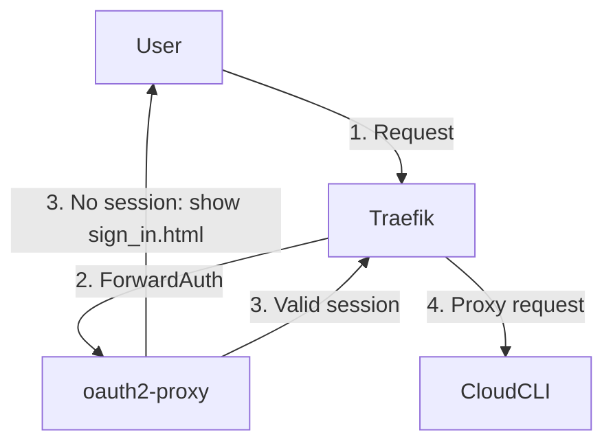

# claude-code-ui compose stack

Traefik (TLS + reverse proxy) and oauth2-proxy (username/password login) in
front of [CloudCLI](https://cloudcli.ai), the npm package for
[siteboon/claudecodeui](https://github.com/siteboon/claudecodeui).

CloudCLI runs on the host, started by `start.sh` — not in a container. Docker
Compose only runs Traefik, oauth2-proxy, a `whoami` test route, and a one-shot
init container that creates CloudCLI's first user.

## Request flow



Traefik forwards every request to oauth2-proxy for a ForwardAuth check. Without
a valid session, oauth2-proxy serves `sign_in.html` for htpasswd credentials;
once authenticated, Traefik proxies the request on to CloudCLI.

## Layout

- `docker-compose.yml` — Traefik, oauth2-proxy, whoami, cloudcli-init.
- `sign_in.html` — oauth2-proxy's sign-in page (username/password only).
- `.htpasswd` — basic-auth credentials for oauth2-proxy. Gitignored.
- `.env` — config and credentials, copied from `.env.example`. Gitignored.
- `data/` — CloudCLI's SQLite DB, pid file, and log. Gitignored.

## Env vars

Copy `.env.example` to `.env` and fill in:

| Var | Purpose |
|---|---|
| `LE_ACCOUNT_EMAIL` | Let's Encrypt account email |
| `SERVER_FQDN` | Public hostname of this host |
| `CLOUDCLI_DATA_DIR` | Host dir for CloudCLI's DB/pid/log |
| `CLOUDCLI_INIT_USERNAME` / `CLOUDCLI_INIT_PASSWORD` | CloudCLI's first user |
| `*_VERSION` | Pinned image/binary versions |

## Running

```
./start.sh                    # (re)start docker compose; leave a running CloudCLI alone
./start.sh --restart-cloudcli # also stop and restart the CloudCLI process
```

`start.sh` uses the `cloudcli` binary if it's on `PATH`, otherwise
`npx -y @cloudcli-ai/cloudcli`.

## Before exposing publicly

- Change `CLOUDCLI_INIT_PASSWORD` in `.env`.
- Replace `.htpasswd` with your own user(s): `htpasswd -c .htpasswd <user>`.

## Avoiding double login

The `build-cloudcli/` directory contains a custom Dockerfile that compiles
claudecodeui with `VITE_IS_PLATFORM=true` at build time. This embeds
platform-mode configuration into the bundle, skipping CloudCLI's auth flow
entirely — users authenticate once via oauth2-proxy and proceed directly to
the app.
