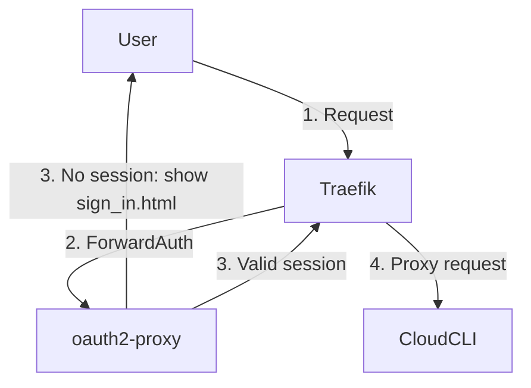

# claude-code-ui compose stack

Traefik (TLS + reverse proxy) and oauth2-proxy (username/password login) in
front of [CloudCLI](https://cloudcli.ai), the npm package for
[siteboon/claudecodeui](https://github.com/siteboon/claudecodeui).

CloudCLI runs on the host, started by `start.sh` — not in a container. Docker
Compose only runs Traefik, oauth2-proxy, a `whoami` test route, and a one-shot
init container that creates CloudCLI's first user.

## Request flow


```mermaid
graph TD
    user["User"] -->|1. Request| traefik["Traefik"]
    traefik -->|2. ForwardAuth| oauth["oauth2-proxy"]
    oauth -->|3. No session: show sign_in.html| user
    oauth -->|3. Valid session| traefik
    traefik -->|4. Proxy request| backend["CloudCLI"]
```

Traefik forwards every request to oauth2-proxy for a ForwardAuth check. Without
a valid session, oauth2-proxy serves `sign_in.html` for htpasswd credentials;
once authenticated, Traefik proxies the request on to CloudCLI.

## Layout

- `docker-compose.yml` — Traefik, oauth2-proxy, whoami, cloudcli-init.
- `start.sh` / `stop.sh` — start/stop CloudCLI and the compose stack.
- `status.sh` — health report for CloudCLI and the compose stack.
- `install-cloudcli-service.sh` — install CloudCLI as a systemd user service (start on boot).
- `sign_in.html` — oauth2-proxy's sign-in page (username/password only).
- `.htpasswd` — basic-auth credentials for oauth2-proxy. Gitignored.
- `.env` — config and credentials, copied from `.env.example`. Gitignored.
- `data/` — CloudCLI's SQLite DB, pid file, and log. Gitignored.

## Env vars

Copy `.env.example` to `.env` and fill in:

| Var | Purpose |
|---|---|
| `LE_ACCOUNT_EMAIL` | Let's Encrypt account email |
| `SERVER_FQDN` | Public hostname of this host |
| `CLOUDCLI_DATA_DIR` | Host dir for CloudCLI's DB/pid/log |
| `CLOUDCLI_INIT_USERNAME` / `CLOUDCLI_INIT_PASSWORD` | CloudCLI's first user |
| `*_VERSION` | Pinned image/binary versions |

## Running

```
./start.sh                    # (re)start docker compose; leave a running CloudCLI alone
./start.sh --restart-cloudcli # also stop and restart the CloudCLI process
```

`start.sh` uses the `cloudcli` binary if it's on `PATH`, otherwise
`npx -y @cloudcli-ai/cloudcli`.

## Status

```
./status.sh            # check everything; exits non-zero if any check fails
./status.sh --verbose  # also print the CloudCLI log tail and `docker compose ps`
```

Checks the CloudCLI process (pid file, port 3010, `/health`), the boot service
and linger, each Docker Compose service (state, health, `cloudcli-init` exit
code), and the public endpoint through Traefik (`/oauth2/sign_in`, pinned to
127.0.0.1). An untrusted TLS certificate is reported as a warning, not a
failure. The CloudCLI log tail is printed automatically when a CloudCLI check
fails.

## Start on boot

The Docker Compose services already restart on boot (`restart: unless-stopped`).
To do the same for CloudCLI, install it as a systemd user service:

```
./install-cloudcli-service.sh            # write, enable and start cloudcli.service
./install-cloudcli-service.sh --restart  # also replace an already-running cloudcli now
```

The script writes `~/.config/systemd/user/cloudcli.service` with the absolute
`cloudcli` path and the current `PATH` baked in (systemd doesn't load nvm), and
enables linger so the service starts at boot without a login. If that fails, run
`sudo loginctl enable-linger $USER` once. Re-run the script after upgrading
node/nvm or changing `.env`.

The service is restarted if it crashes. It writes the same pid file and log as
`start.sh`, so `status.sh`, `start.sh` and `stop.sh` keep working. A CloudCLI
already started by `start.sh` is left alone (replacing it drops live terminal
sessions); the service takes over on the next boot, or pass `--restart`.

```
systemctl --user status cloudcli    # service state
systemctl --user restart cloudcli   # restart under the service
systemctl --user disable cloudcli   # stop starting on boot
```

Use `systemctl --user restart cloudcli` rather than
`./start.sh --restart-cloudcli` once the service is installed: the latter
restarts CloudCLI outside the service, so it won't be restarted if it crashes
until the next boot.

## Before exposing publicly

- Change `CLOUDCLI_INIT_PASSWORD` in `.env`.
- Replace `.htpasswd` with your own user(s): `htpasswd -c .htpasswd <user>`.

## Avoiding double login

The `build-cloudcli/` directory contains a custom Dockerfile that compiles
claudecodeui with `VITE_IS_PLATFORM=true` at build time. This embeds
platform-mode configuration into the bundle, skipping CloudCLI's auth flow
entirely — users authenticate once via oauth2-proxy and proceed directly to
the app.
